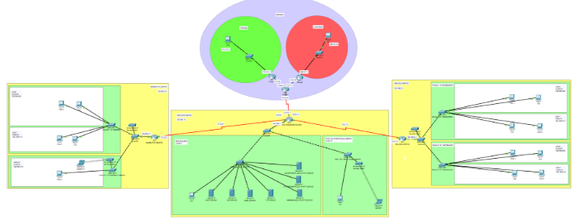
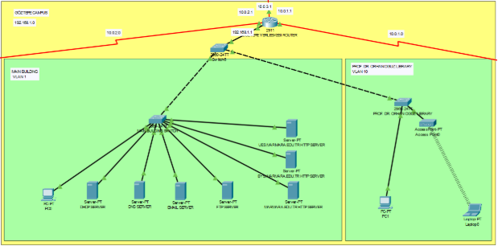
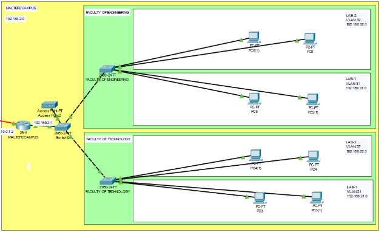
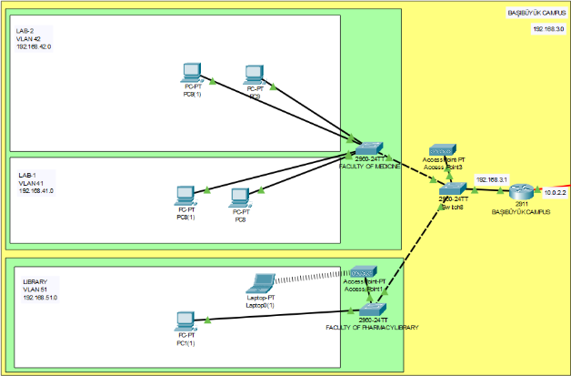

1) **İÇİNDEKİLER**
1) Giriş
1) Yöntem
1) Bulgular
1) Github

1) **GİRİŞ**

Bu projede, Marmara Üniversitesi’nin ağ altyapısını Cisco Packet Tracer üzerinde modelleme ve simüle edilmesi amaçlanmıştır. Marmara Üniversitesi’nin bazı kampüs ve fakültelerinin birbirleriyle güvenli ve hızlı bir şekilde haberleşmesini sağlayan bir ağ yapısı tasarlanmıştır. Bu projenin hedefleri içerisinde, gerçek dünyadaki bir üniversitenin ağ altyapısının topolojisini öğrenmek, (DHCP, Email, FTP, DNS, HTTP) sunucularının çalışma şeklini görmek, (Statik Yönlendirme Algoritması, VLAN, Firewall, Server) çeşitli konfigürasyonların yapılandırmasını öğrenmek ve uygulamak hedeflenmiştir.

1) **YÖNTEM**

**Kullanılan Yazılım:** 

Cisco Packet Tracer 

**Yapılanlar:**

1) **Topoloji Planlanması:**
- Marmara Üniversitesi’nin kampüslerinden birkaçı (Göztepe Kampüsü, Maltepe Kampüsü, Başıbüyük Kampüsü) örnek olarak seçilmiştir. Yıldız Topolojisine uygun olacak şekilde bu kampüslerden Göztepe Kampüsü merkez nokta olarak belirlenmiştir ve diğer kampüsler Göztepe kampüsüne bağlanmıştır. Üniversite sunucuları Göztepe Kampüsü merkez olması nedeniyle bu alanda toplanmıştır.
- Her bir seçilen kampüs için örnek fakülteler ve kütüphaneler seçilmiştir. Kampüsler içerisinde, dış ağa bağlanmak için her bir kampüse 1 router ve 1 switch, fakültelerin birbirine bağlanması için her bir fakülteye 1 switch, fakülteler içerisindeki laboratuvarların ve kütüphanelerin birbirine bağlanması için fakültelerdeki switch üzerinde VLAN yapılandırılması kullanılmıştır.
- Göztepe Kampüsü’nden dış ağlara bağlanmak hedeflenmiştir. Bunun için Göztepe Kampüsü’nün  routerı üzerinden güvenlik için Firewall kullanılmıştır. Burada güvenilir bir ağ ve güvenilmez bir ağ simüle edilerek Firewall konfigürasyonları yapılandırılmıştır.

1) **Kullanılan Cihazlar:**
- 6 Router (Kampüsler için 3, Dış internet simülasyonu için 3)
- 11 Switch (Kampüsler için 3, Fakülteler için 6, Dış ağ simülasyonu için 2)
- 7 Server (1 DHCP Server, 1 Email Server, 1 FTP Server, 1 DNS Server, 3 HTTP Server)
- 18 Host

1) **IP Planlaması:**
- Her bölüm için farklı alt ağlar (subnet) belirlendi.
- Router üzerinde, interface çıkışları için IP konfigürasyonları yapılarak alt ağlar oluşturuldu.
- Switch üzerinde VLAN’lar oluşturularak yeni alt ağlar oluşturuldu.

1) **Server Yapılandırması:**

**DHCP Server:**

- DHCP Server’da servis kısmından belirlenen her bir alt ağ için IP havuzu oluşturuldu. 
- Router üzerinde DHCP Server’a erişmek için (ip helper-address) komutu kullanılarak DHCP trafiğini izinli hale getirildi.

  **Email Server:**

- Email Server’da servis kısmında Marmara E-Posta adresi için domain adı belirlendi ve kullanıcılar eklendi.

  **FTP Server:**

- FTP Server’da dosya  transfer işlemleri için kullanıcı oluşturularak gerekli izinler verildi.

  **DNS Server:**

- DNS Server’da her bir HTTP Server’ın domain adresinin IP adresine dönüşümü için kayıtlar yapıldı.
- Host cihazlarda DNS konfigürasyonları yapıldı.

  **HTTP Server:**

- Marmara Üniversitesi’nin Web siteleri için HTTP Server’lar oluşturuldu.
- Bu sunucular için DNS Server’da gerekli konfigürasyonlar yapıldı.

1) **Yönlendirme:**
- Router’lar üzerinde her bir ağ için Statik Yönlendirme protokolü uygulandı.
- Her alt ağ birbiriyle haberleşecek şekilde yönlendirme kuralları tanımlandı.

1) **VLAN Yapılandırması:**
- Fakülteler içerisindeki switch üzerinde laboratuvar ve kütüphane için VLAN’lar oluşturuldu.
- VLAN’ların diğer ağlarla haberleşmesi için router üzerinde arayüz tanımlanmaları yapıldı.

1) **İnternet Simülasyonu:**

- İnterneti simüle etmek için ayrı bir network oluşturuldu. Bu network içerisinde güvenilir ve güvenilmez olarak iki farkı LAN oluşturuldu.
- Göztepe Kampüsü’ndeki router üzerinden bu dış ağa, güvenlik için arada Firewall olacak şekilde bağlantı sağlandı. Firewall üzerinde güvenilir ağdan mesajlar alırken güvenilmez ağ için engel konuldu.

1) **BULGULAR:**

**Genel Topoloji**

Marmara Üniversitesi’nin ağ altyapısı, yıldız (star) topolojisi esas alınarak tasarlanmıştır. Bu yapı kapsamında Göztepe Kampüsü merkez (hub) olarak belirlenmiş ve diğer kampüsler (Maltepe ve Başıbüyük) bu merkeze bağlanmıştır. Böylece kampüsler arası veri trafiği kontrol edilebilir ve merkezi sunucular üzerinden yönetilebilir bir hale getirilmiştir.

Ağın dış dünya ile bağlantısını sağlamak amacıyla bir internet simülasyonu oluşturulmuştur. Bu simülasyon sayesinde üniversite ağı ile dış ağlar arasında veri alışverişi başarıyla gerçekleştirilmiştir. Erişim noktası Göztepe Kampüsü üzerinden sağlanmış, bu geçişte bir Firewall kullanılarak güvenilirlik kontrolü sağlanmıştır.

Bu yapı sayesinde Marmara Üniversitesi’nin iç ağında yer alan cihazların:

- Dış ağlara (örneğin HTTP, DNS, Email sunucuları) erişimi,
- Dışarıdan gelen erişimlerin sınırlandırılması,
- Gerçek bir üniversite altyapısına benzer merkezi ve güvenli bir yapı oluşturulması sağlanmıştır.

**Göztepe Kampüsü**

Göztepe Kampüsü, üniversite ağı için merkez kampüs olarak yapılandırılmıştır. Bu nedenle, tüm servislerin bulunduğu sunucular bu kampüse yerleştirilmiştir. Kurulan sunucular ve işlevleri aşağıdaki gibidir:

- **DHCP Server:** Diğer kampüslerdeki ve VLAN’larda bulunan host cihazlara otomatik IP adresi ataması sağlanmıştır. Router’lar üzerinde ip helper-address komutu kullanılarak farklı alt ağlardan gelen DHCP istekleri yönlendirilmiştir.
- **DNS Server:** HTTP sunuculara erişim için alan adı (domain) ile IP adresi dönüşümü gerçekleştirilmiştir. Host cihazlara uygun DNS adresi atanarak testler yapılmıştır.
- **Email Server:** Üniversitenin iç e-posta sistemi yapılandırılmıştır. Kullanıcılar ve domain adresi tanımlanarak mesaj gönderimi ve alımı başarıyla test edilmiştir.
- **FTP Server:** Sunucuya yüklenen dosyalar, ağdaki kullanıcılar tarafından FTP protokolü ile erişilerek indirilebilmiş ve yüklenebilmiştir.
- **HTTP Server:** Üniversiteye ait web sayfalarının çalıştığı sunucular kurularak, DNS üzerinden alan adı ile erişim test edilmiştir.

Göztepe Kampüsü ayrıca üniversitenin dış ağ bağlantı noktasını da oluşturur. Router ile internete çıkış bu kampüs üzerinden sağlanmıştır. Dış bağlantı sırasında ağ güvenliğini sağlamak amacıyla Firewall yapılandırılmış, sadece güvenilir ağlardan gelen trafiğe izin verilmiş, güvenilmez kaynaklardan gelen bağlantılar ise engellenmiştir.

**Maltepe Kampüsü**

Maltepe Kampüsü’nde yer alan Teknoloji Fakültesi ve Mühendislik Fakültesi için farklı VLAN’lar oluşturulmuştur. Bu fakültelerin içerisindeki laboratuvar birimleri de kendi içlerinde bağımsız VLAN’lar ile ayrılmıştır. Bu yapı sayesinde, kampüs içerisindeki veri trafiği izole edilmiş, ağ güvenliği ve yönetilebilirliği artırılmıştır.

Switch üzerinde yapılan bu yapılandırmalar sayesinde, farklı VLAN’lara sahip cihazlar yalnızca router üzerinden haberleşebilmekte, bu da ağ segmentasyonu sağlamaktadır.

**Başıbüyük Kampüsü**

	

Başıbüyük Kampüsü içerisinde, Tıp Fakültesi ve Kütüphane birimleri için ayrı VLAN yapılandırmaları gerçekleştirilmiştir. Fakülte ve kütüphane içindeki cihazlar, kendi VLAN’larında izole edilmiş şekilde yapılandırılarak veri güvenliği ve ağ yönetimi kolaylaştırılmıştır.

**İnternet**

Ağ altyapısında, Marmara Üniversitesi’nin dış ağlarla bağlantısını test edebilmek amacıyla bir internet simülasyonu gerçekleştirilmiştir. Bu simülasyon içerisinde iki farklı dış ağ oluşturulmuştur:

- Güvenli Ağ (Trusted Network)
- Güvensiz Ağ (Untrusted Network)

Her iki ağ da Göztepe Kampüsü’ne bağlı olan router üzerinden üniversite ağına ulaşmaya çalışmaktadır. Araya yerleştirilen Firewall cihazı, bu ağlardan gelen veri trafiğini kontrol etmek üzere yapılandırılmıştır.

Yapılan konfigürasyon sonucunda:

- Güvenli ağdan gelen veri paketleri Firewall tarafından kabul edilmekte ve üniversite ağına geçişine izin verilmektedir.
- Güvensiz ağdan gelen veri paketleri ise Firewall tarafından engellenmekte, iç ağa ulaşmalarına izin verilmemektedir.

Bu yapı sayesinde, Marmara Üniversitesi’nin dış bağlantıları üzerinde güvenlik katmanı oluşturulmuş, sadece yetkili ve güvenli kaynaklardan gelen trafiğin üniversite ağına erişebilmesi sağlanmıştır.

